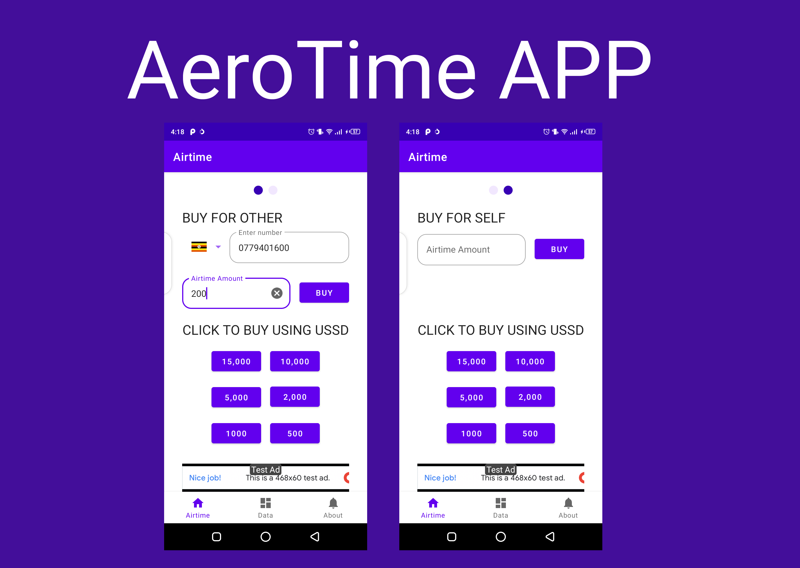

# AeroTime



## About
- Buy airtime and data using this open source app.
- [Playstore](https://play.google.com/store/apps/details?id=com.maku.aerotime) - Live on the play store for user in Uganda 🇺🇬 🇺🇬.

## Built With MVVM 🛠
- [Kotlin](https://kotlinlang.org/) - First class and official programming language for Android development.
- [ViewBinding](https://developer.android.com/topic/libraries/view-binding) - Generates a binding class for each XML layout file present in that module and allows you to more easily write code that interacts with views.
- [Retrofit](https://square.github.io/retrofit/) - A type-safe HTTP client for Android and Java.
- [Data Store](https://developer.android.com/topic/libraries/architecture/datastore)
- [Dagger Hilt](https://dagger.dev/hilt/)
- [Hover USSD Sdk](https://docs.usehover.com/) - Hover automates existing USSD sessions in the background of Android applications
- [Africa's Talking Airtime API](https://africastalking.com/) - With simplified access to telco infrastructure, developers use our powerful SMS, USSD, Voice, Airtime and Payments APIs to bring their ideas to life, as they build and sustain scalable businesses.
- [Flutterwave](https://flutterwave.com/ug/) - The easiest way to make and accept payments from customers anywhere in the world.

## How to use this project
- Clone this repo.
- Go to [Africa's Talking Airtime API](https://africastalking.com/) , create an account get the api key and username.
- Go to [Flutterwave](https://flutterwave.com/ug/) , create an account get the public key.
- Go to [HOVER SDK](https://docs.usehover.com/) , follow the instructions, create an account and action.
- Create a new file called key.properties and add API_KEY=xxxx, PUBLICKEY=xxx, HOVER_ACTION=xxx etc run the app.
- enjoy

## Contact
If you need any help, you can connect with me.

Connect and aend me a message here:- [maku](https://www.linkedin.com/in/maku-mazakpe-700a3a165/)

## License
```
MIT License
